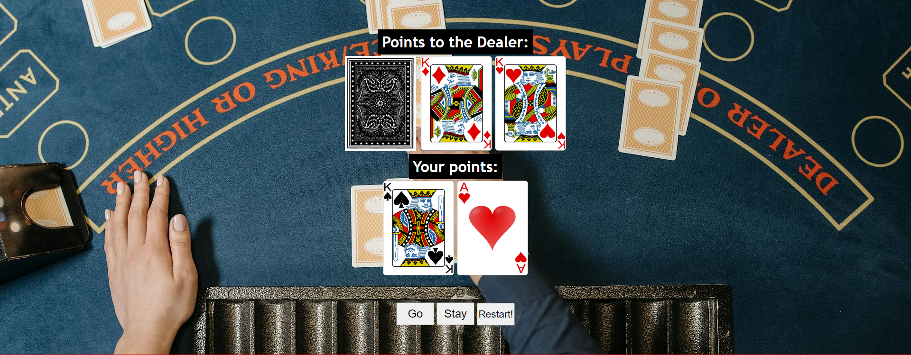
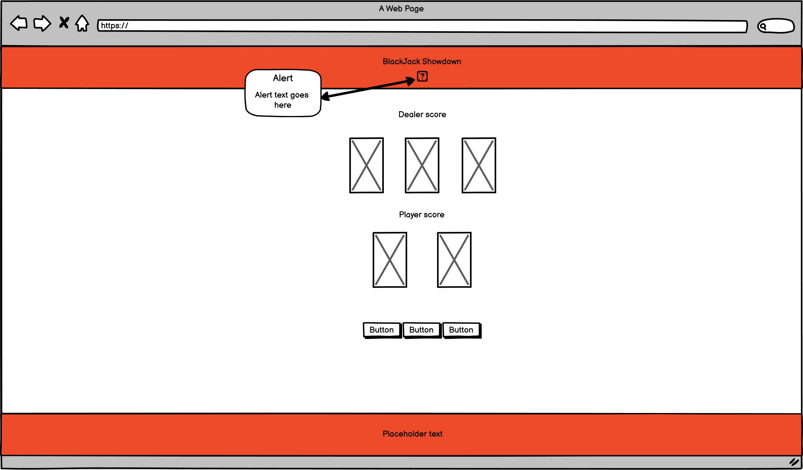
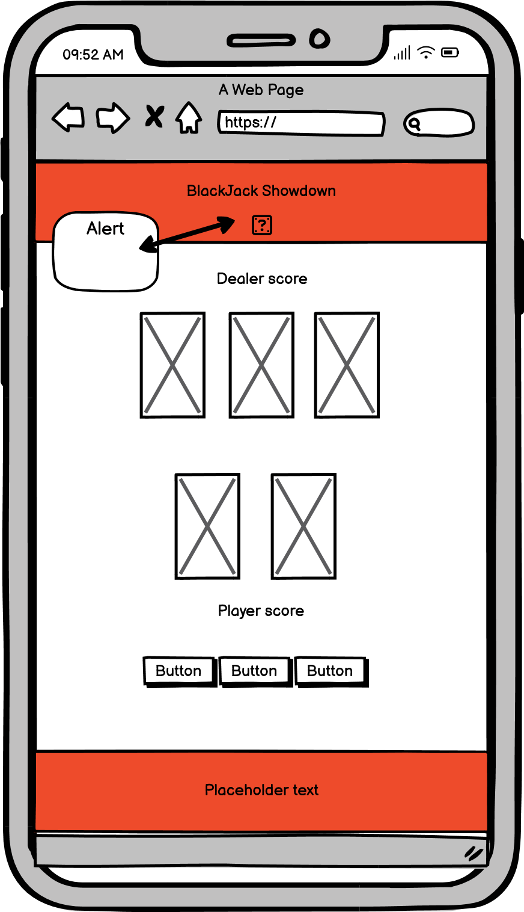

# *Welcome to BlackJack Showdown *

This is a website dedicated to making people experience the beautiful game of Blackjack!

Our website can be accessed through this [link](https://kevinolm10.github.io/BlackJack-Showdown/)

---
## User Stories

### First time Visitor:

* Being a Visitor for the first time, the website is supposed to have a clear goal for the user.
* Being a Visitor for the first time, the user should be able to clearly navigate the page through its responsiveness.
* Being a Visitor for the first time, I want the user to be able to play the game i have created and to have fun without bugs in a well built enviornment.

### Returning Visitor:

* Being a Returning Visitor, I want the user to be able to re-read the game rules.
* Being a Returning Visitor, I want the user to be able to play the game as intended and replay it with the restart button as many times as they want.
* Being a Returning Visitor, I want the user to be able to track the score with the system i have implemented.

### Frequent Visitor:

* Being a Frequent User, the website is supposed to be an enviornment where the user can come and play the beautiful game of Blackjack in there off time.
* Being a Frequent User, I want the user to feel like they have a chance to learn the game, using the scoring system to defeat the dealer.

## Features:

### Header

#### Game information box

   - When the user lands on the page, the first thing they see is a vibrant red background with the title of the website in well defined lettering.
   - Under the title i have provided the user with the text of game information with an arrow pointing to where they should click.
   - The user can press the box with the icon of a question mark to bring up an alert in javascript which provide the game instructions.
   

---

+ ### Landing/Home page

* Introduces user to the purpose of the website and what kind of game is provided.
* Introduces user to the game with the game information and buttons to start the game.
* The big responsive buttons helps the user to navigate the site and know where to press.

---

+ #### Hero section

 - This section introduces the user to a background image of a gambling table with  the actual game being put on top of it.
 - The game includes the scoring of the two parts, the cards being dealt and buttons to press.

 

---

 + #### The Footer

- The footer is designed with simplicity in mind in which it is just a text design which says "A fun way to experience blackjack!".
- The footer has a vibrant red color which ties together with the header.

---

## Technologies Used

- [HTML](https://developer.mozilla.org/en-US/docs/Web/HTML) is used to create the foundation of the website.
- [CSS](https://developer.mozilla.org/en-US/docs/Web/css) - Was used to style and place the elements of the website.
- [CSS Flexbox](https://developer.mozilla.org/en-US/docs/Learn/CSS/CSS_layout/Flexbox) - Flexbox is used to place and rearrange the elements on the website.
- [Balsamiq](https://balsamiq.com/) The wireframes was created in balsamiq.
- [Gitpod](https://gitpod.com/) Gitpod was used as the tool to write code.
- [GitHub](https://github.com/) was used to host the code of the website.

---

## Design

### Colors Used

- Black color used as main color for text on the website to make it easy to read.

- Red background color for the header as well as the footer to provide a sense of casino feeling for the user.

- For the h2 elements i have used a black background with white color text to not distract the user from the main background image.

### Font types Used

- Trebuchet MS was used as the font throughout the website as i thought it gave a comic game like feeling which makes sense in card games.

---

### Wireframes

#### Mobile

- 

---
#### Desktop

---

## Testing

Refer to my [TESTING.md] file to see the testing done.

---

## Deployment

Deployment to Github

- The site was deployed to GitHub pages. The steps to deploy are as follows:
- In the GitHub repository, navigate to the Settings tab
- From the source section drop-down menu, select the Main Branch, then click "Save".
- The page will be automatically refreshed with a detailed ribbon display to indicate the successful deployment.
The live link can be found here

---

## Future Features to Implement

- Add better responsiveness to the page in sense of hover effects and other fun features.

- Change the css for the page to make it more aesthetically pleasing. 

- Finish the flexbox for the videos page, (make it look like it does in the wireframe.)

- Add more in depth content such as a betting system with fake money and a way to show highscores.

- Add more Favicons to the pages as fun features.

- Improve the quantity and quality of my commit messages. The commit messages where sort of shaky throughout my work and i will make them more consitent and better in my next project.

---

## Credits

+ #### Content

- Inspiration for the project came from this tutorial [chris-lloyd] (https://codesandbox.io/s/javascript-beginner-tutorial-blackjack-epegw)
- A big inspiration and help for the project in terms of javascript code came from [Newb2CodingCareer] (https://stackoverflow.com/questions/77293429/how-can-i-make-my-javascript-blackjack-game-have-one-function-to-add-up-the-valu).
- Inpiration for the code form came from code institute.
- Used code institute fullstack developer course to go back and relearn ways to code.
- https://www.w3schools.com/ was used to get help with coding.

+ #### Media

+ [Hero-image] (https://www.pexels.com/photo/dealer-holding-playing-cards-7594301/)

+ [Card-images]
- [Cards] (https://opengameart.org/content/playing-cards-vector-png)

+ [Card-back-image]
- [Hidden-Card] (https://opengameart.org/content/colorful-poker-card-back)
---

## Acknowledgments

- An honorable mention is my mentor Julila Konn who has helped me with ideas and inspiration for the website!

---