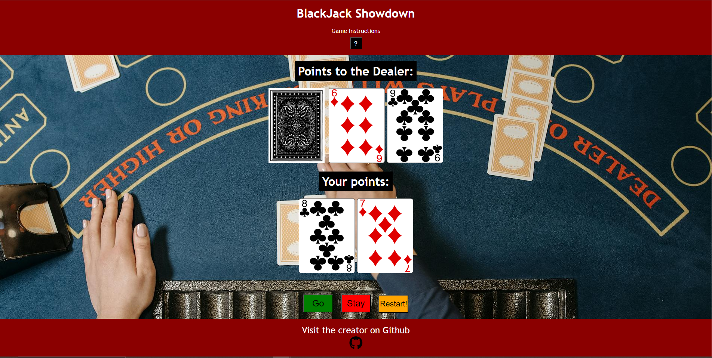
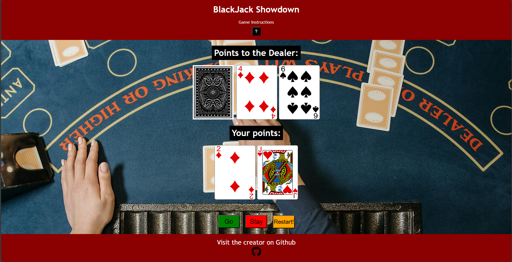
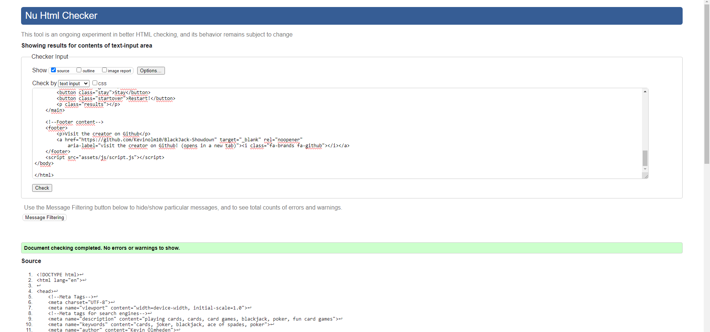
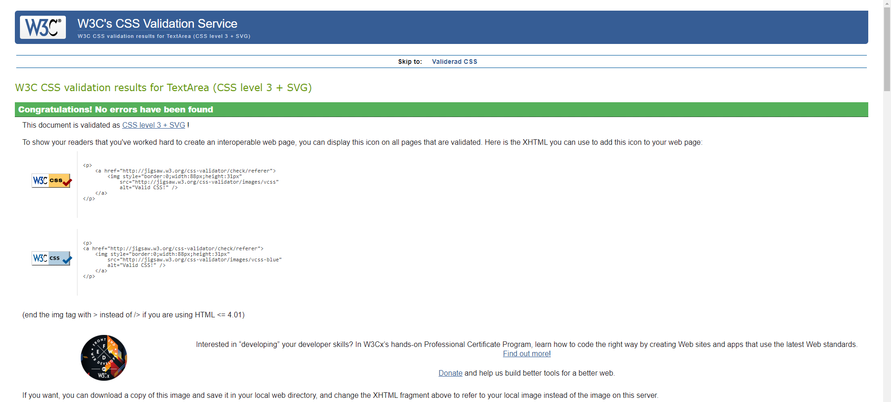
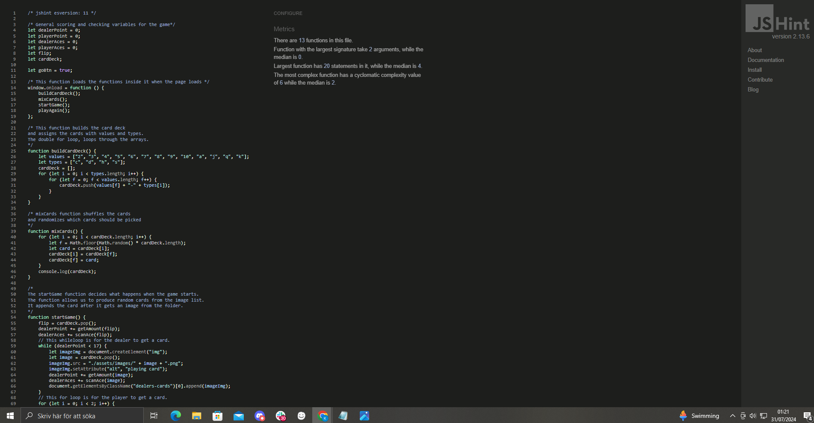
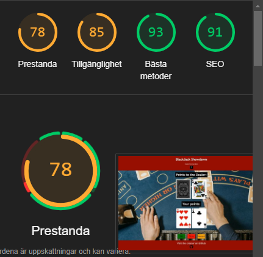
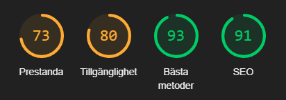

# TESTING

## Compatibility

- Google Chrome:

- Microsoft Edge:

- Safari:

## Manual testing

| feature | action | expected result | tested | passed |
| --- | --- | --- | --- | --- |
| Game instructions box | Clickable button | When button is pressed, user gets an alert with game instructions | Yes | Yes |
| Go button | Clickable button | When button is pressed, user gets a new card if under 21 points | Yes | Yes |
| Stay button | Clickable button | When button is pressed, the turn is over and the dealer gets his cards | Yes | Yes |
| Reset button| Clickable button | When button is pressed, the page reloads and the game is reset | Yes | Yes |
---
## Validator testing

+ ### HTML

#### Home Page

- No errors shown

+ ### CSS

- No errors shown

+ ### Javascript/jshint

## LightHouse Report

### Home Page

#### Desktop
 

#### Mobile
 

---

## Bugs

+ ### Solved Bugs

1. The game informations box for some reason displayed the url to the page, which is now removed.

2. Several issues regarding flex-box in the with the cards was solved.

3. Bugs with the images not loading even though the link to the images folder was correct, has now been fixed.

4. The stay function and button did not work as expected and has now been sorted out.

5. The favicon for the page was not being displayed correctly, this is now solved.

---

+ ### Unsolved Bugs

- The flexbox for the header does not display correctly for mobile and desktop, needs to be solved.
- The buttons move down to the footer on mobile if the dealer has 4 cards or more.
---